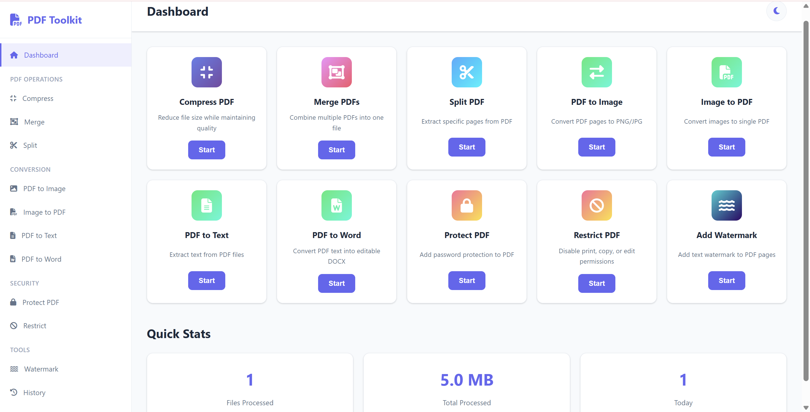

# PDF Toolkit

A simple PDF processing application built with FastAPI and Vanilla JavaScript. Process PDF files directly on your computer without uploading them to third-party services.




## Features

### Compress PDF

Reduce PDF file size using Ghostscript optimization.

Compression profiles:

- Screen (Maximum Compression)
- eBook (Balanced)
- Printer (High Quality)
- Prepress (Highest Quality)

Depending on document content, file size can typically be reduced by up to **80%**.

### Merge PDFs

Combine multiple PDF files into a single document while preserving page order.

### Split PDF

Extract specific pages or split large PDF files into smaller documents.

### PDF to Image

Convert PDF pages into image files.

Supported formats:

- PNG
- JPG

Resolution options:

- 100 DPI
- 150 DPI
- 200 DPI
- 300 DPI

### Image to PDF

Convert multiple JPG, JPEG, and PNG images into a single PDF document.

### PDF to Text

Extract text content from PDF files for editing, searching, or analysis.

### Protect PDF

Add password protection to prevent unauthorized access.

### Restrict PDF Permissions

Control document permissions such as:

- Printing
- Copying
- Editing

### Add Watermark

Apply custom text watermarks to all pages.

Options include:

- Custom Text
- Adjustable Opacity
- Center Placement
- Multiple Color Choices

### Preview Mode

Generate document previews before downloading.

### Download History

Track processed files during the current session.

---

## Requirements

Before running the application, make sure the following are installed:

- Windows 10 or Windows 11
- Python 3.10 or newer
- Ghostscript

---

## Installation

### 1. Install Python

Download and install Python:

https://www.python.org/downloads/

During installation, make sure **"Add Python to PATH"** is checked.

### 2. Install Ghostscript

Download and install Ghostscript:

https://ghostscript.com/releases/gsdnld.html

### 3. Download Project

Download or clone this repository and extract the project folder.

---

## Getting Started

### First Time Setup

Run:

```text
start-production.bat
```

This will:

- Install required Python packages
- Start the application server
- Open the application in your browser

**Note:** This step only needs to be done once.

---

### Launch Application

After the initial setup is complete, simply run:

```text
start-app.bat
```

The application will start immediately using the previously installed dependencies.

If you reinstall Python or encounter dependency issues, run:

```text
start-production.bat
```

again.

---

## Project Structure

```text
pdf-toolkit/
├── backend/
├── frontend/
├── uploads/
├── outputs/
├── requirements.txt
├── start-app.bat
├── start-production.bat
├── README.md
└── .gitignore
```

---

## Technology Stack

### Backend

- FastAPI
- PyPDF2
- pdf2image
- Pillow
- Ghostscript

### Frontend

- HTML
- CSS
- JavaScript

---

## Privacy

All files are processed locally on your device.

- No file uploads
- No subscriptions
- No external PDF services
- Full control over your documents
